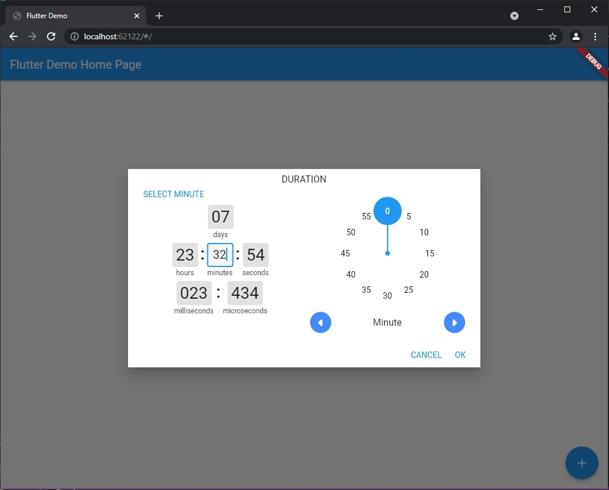
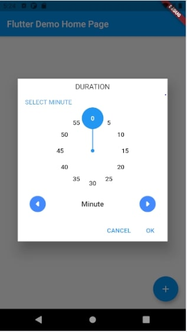
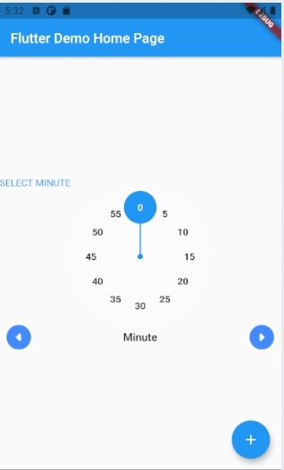

# Dialog Box for picking Duration via UI.

### DialogBox allow user to  Select any of Duration fields like - 
1. Days
2. Hours
3. Minutes
4. Seconds
5. MilliSeconds
6. MicroSeconds


# Example Usage

It will show a dialog box for duration with Duration(days: 7, minutes: 32, hours: 23, seconds: 54, milliseconds: 23, microseconds: 434) initialized. Now user can change it as per need. 


```
import 'package:flutter/material.dart';
import 'package:duration_picker/duration_picker/duration_picker.dart';

void main() {
  runApp(MyApp());
}

class MyApp extends StatelessWidget {
  // This widget is the root of your application.
  @override
  Widget build(BuildContext context) {
    return MaterialApp(
      title: 'Flutter Demo',
      theme: ThemeData(
        primarySwatch: Colors.blue,
      ),
      home: MyHomePage(title: 'Flutter Demo Home Page'),
    );
  }
}

class MyHomePage extends StatefulWidget {
  MyHomePage({Key? key, this.title}) : super(key: key);

  final String? title;

  @override
  _MyHomePageState createState() => _MyHomePageState();
}

class _MyHomePageState extends State<MyHomePage> {

  @override
  Widget build(BuildContext context) {
    return Scaffold(
      appBar: AppBar(
        title: Text(widget.title!),
      ),
      body: Center(
          child:
          TextButton(
            onPressed: () async{
              showDurationPicker(context: context, initialDuration: Duration(days: 7, minutes: 32, hours: 23, seconds: 54, milliseconds: 23, microseconds: 434));
            },
            child: Text("Show Duration Box "),
          )
      ),
      floatingActionButton: FloatingActionButton(
        tooltip: 'Increment',
        onPressed: () {  },
        child: Icon(Icons.add),
      ), // This trailing comma makes auto-formatting nicer for build methods.
    );
  }
}
```





User can also use Duration Picker Mode as per Need.
```
_DurationPickerMode { 
    Day, 
    Hour, 
    Minute, 
    Second, 
    MilliSecond, 
    MicroSecond }
```
 Like as below..

 ```
showDurationPicker(
    context: context,
    initialDuration: Duration(),
    durationPickerMode: DurationPickerMode.Hour);
 ```


User can also use Duration Picker as a Widget usig below code.

```
DurationPicker(
    duration: _duration,
    onChange: (value) {
        setState(() {
            _duration = value;
        });
    },
)
```

